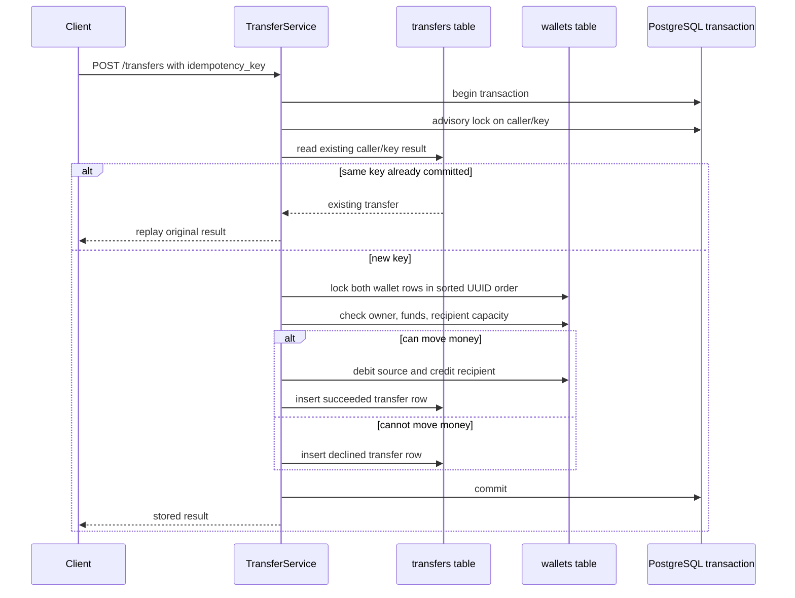

# Design and reasoning

## Architecture

```mermaid
flowchart LR
    Reviewer[Reviewer / browser] --> UI[Vercel React UI]
    UI -->|/api rewrite| API[Render Docker web service]
    Reviewer -->|curl / Postman| API
    API --> Spring[Spring Boot controllers and services]
    Spring --> JDBC[Spring JDBC repositories]
    JDBC --> DB[(Supabase PostgreSQL)]
    Spring --> Logs[Structured JSON logs]
    Spring --> Metrics[/metrics Prometheus endpoint]
```



## Requirements checklist

| Requirement from exercise/rubric | Implementation |
| --- | --- |
| `POST /wallets` get-or-create | `WalletController` + `WalletService` + `INSERT ... ON CONFLICT(user_id) DO NOTHING` |
| `GET /wallets/{id}` | Owner-scoped wallet lookup |
| `POST /transfers` | Atomic transfer with `from`, `to`, `amount_paise`, `idempotency_key` |
| `GET /transfers/{id}` | Sender/recipient-visible transfer lookup |
| Bearer token per user | Spring Security maps configured tokens to caller IDs |
| Integer paise, no floats | JSON integer validation, Java `long`, PostgreSQL `BIGINT` |
| Conservation | Debit, credit, and transfer row commit in one transaction |
| No overdraft | Locked balance check before debit; declined result persists |
| Exactly-once retry | Advisory key lock plus unique `(user_id, idempotency_key)` transfer row |
| Same key, different body | Returns `409 idempotency_key_conflict` |
| Race-free wallet create | Unique `wallets.user_id` plus conflict-safe insert |
| Opposite direction contention | Wallet rows locked in deterministic sorted UUID order |
| Burst scripts | `scripts/burst.py` and `scripts/reversal-burst.py` |
| Dockerfile | Multi-stage backend image, non-root runtime user, health check |
| Compose | `compose.yaml` starts app and PostgreSQL with one command |
| Live deployment | Render backend, Supabase PostgreSQL, Vercel UI |
| Logs and correlation IDs | JSON request/domain logs with `X-Correlation-ID` |
| Metrics | `/metrics` includes HTTP metrics and wallet domain counters |
| R3 reversal/refund | `POST /transfers/{id}/reverse` implemented, tested, and deployed |

**Model.** A wallet has one unique user, UUID and nonnegative BIGINT paise balance. A transfer stores caller, source, recipient, positive amount, final outcome, reason and unique `(user_id, idempotency_key)`. Foreign keys and checks enforce basic integrity. Get-or-create uses PostgreSQL `ON CONFLICT DO NOTHING` and a fresh read at READ COMMITTED; a database uniqueness constraint arbitrates races.

**Atomic movement.** `TransferService.transfer` is a public Spring-proxied `@Transactional` method. It acquires both wallet row locks in deterministic normalized UUID string order using separate `SELECT ... FOR UPDATE` queries. Opposite-direction transfers wait on the same first row, preventing circular wallet-lock waits. Ownership, available funds and recipient capacity are checked while locked. Debit, credit and the final transfer row commit together. Failures roll back all three effects. A decline stores its result and moves no money. Arithmetic is integer `long` bounded to JSON's interoperable safe-integer range; capacity uses subtraction before addition to avoid overflow.

**Idempotency.** Before any wallet lock, a transaction-scoped PostgreSQL advisory lock serializes the caller/key. A hash collision adds waiting but does not merge keys. The stored record is then checked under READ COMMITTED: same normalized input returns the original result; different input returns 409. A SQL unique constraint is a second guard. A lost HTTP response is handled by replaying the same key, whether the original transaction rolled back or committed. This guarantees one committed database effect per accepted key, not exactly-once network delivery. Declines are durable outcomes; validation errors do not claim keys.

**Alternatives.** Explicit row locks keep the two-row operation auditable with Spring JDBC. A conditional debit is valid but still needs ordered locking when the recipient is updated; it alone does not solve opposite-direction deadlock. SERIALIZABLE would add serialization-abort retries without simplifying this operation. JPA is unnecessary for these few explicit locking queries. Redis locks, queues and distributed transactions introduce extra consistency boundaries for data already held in one database.

**Failure posture.** PostgreSQL is the only balance authority. Outages and lock/statement deadlines return a retryable 503; there is no in-memory fallback or queued success. This sacrifices availability during outages and contention. Durability depends on database storage and replication configuration; asynchronous failover is not claimed to preserve every acknowledged write. Logs and counters are best-effort post-commit telemetry, not a durable ledger export. A transactional outbox would be appropriate if downstream delivery became a requirement.

**Testing and disclosure.** The user selected Java and Spring Boot after an initial JavaScript implementation. AI chose the Spring components, SQL locking/idempotency mechanism, project structure, bounds and tests, and generated the implementation and documentation. Those details were AI decisions, not human-authored design or commit history. Local tests use real PostgreSQL and HTTP, including a credit failure after a real debit to prove rollback. The project is deployed on free-tier services: Render for the backend container, Supabase for PostgreSQL, and Vercel for the UI. The user subsequently requested reversal/refund functionality; it is implemented, tested, and deployed.

**Package boundaries.** `controller` handles wallet and transfer endpoints separately. `service` contains wallet operations and the transfer transaction coordinator. `repository` contains separate wallet and transfer SQL adapters sharing the transaction-bound connection. `entity` contains immutable database row records; `model` contains public response DTOs and service commands/outcomes, each in its own file. `mapper` explicitly converts persisted rows to responses. `config`, `validation`, `exception`, and `observability` own cross-cutting infrastructure. Spring JDBC remains the persistence mechanism; the entity package does not introduce JPA or implicit ORM locking.

**Refund transaction.** Only the original recipient can authorize a reversal. The service locks the caller/key first, checks persisted replay identity (operation plus original ID), then locks the original transfer row before any wallet rows. It validates that the original is successful and is not itself a reversal, and checks for an existing successful refund. It uses the exact original amount and reversed directions with the same `moveFunds` primitive as ordinary transfers. Both wallet updates, the refund link and key commit atomically. Locks on the original serialize different refund keys; a partial unique index independently prevents two successful refunds of one original. Insufficient funds or recipient capacity produces a persistent declined attempt; a new key may retry later. Ordinary transfers never acquire original-transfer locks, and both paths acquire wallet locks in deterministic order. Replay checking precedes the already-refunded check so a lost successful response can always be retrieved. V2 adds the linkage and index without rewriting V1 or existing data.
